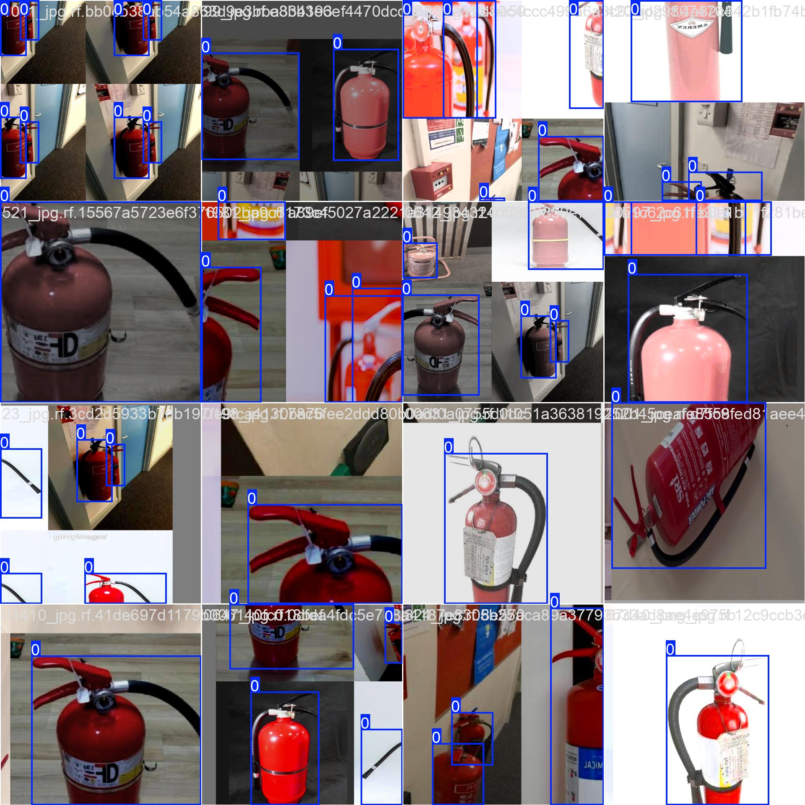

# Detecção de extintores de incêndio

## Introdução

### Identificação 
* Adriando de Arruda Pereira Filho - 20220025597. 
* Colocar o link para o vídeo da apresentação do trabalho. 

### Informações Gerais 
* Descrever o problema.

Identificar extintores de incêndio é uma atividade essencial para a segurança em diferentes ambientes e locais públicos. O fácil acesso a esses dispositivos de segurança é indispensável para garantir a segurança pública em casos de incêndios, e deve estar de acordo com as normas de segurança.

Este projeto tem como objetivo criar um sistema que identifique e reconheça extintores de incêndio utilizando o modelo de detecção de objetos conhecido como [YOLO](https://docs.ultralytics.com/pt) (You Only Look Once). A tarefa envolve o treinamento de um modelo capaz de identificar e localizar extintores em vídeos ou imagens, com o intuito de facilitar a verificação da presença desses dispositivos em locais críticos.

* Descrever a base de dados.

Para o treinamento do modelo de detecção de extintores de incêndio, foi utilizado um dataset já existente da plataforma [Roboflow](https://roboflow.com/) que fornece imagens anotadas para a detecção de extintores em diferentes cenários.

Dataset: [Fire Extinguisher Detect Computer Vision Project](https://universe.roboflow.com/fire-extinguisher-detect-ddy5c/fire-extinguisher-detect)
* Quantidade de imagens: 9636
* Anotações: As imagens estão anotadas com caixas delimitadoras e a classe “fire_extinguisher”.
<div style="display: flex; justify-content: space-around;">
  
  
</div>

## Metodologia 
### Técnicas de Machine Learning (ML)
Utilizamos a técnica de aprendizado profundo com a arquitetura YOLO (You Only Look Once) para realizar a detecção de extintores de incêndio em imagens ou videos. O YOLO é um modelo de detecção em tempo real que realiza a previsão de múltiplos objetos em uma imagem com uma única passagem pela rede neural. Ele é altamente eficiente, pois divide a imagem em uma grade e, em cada célula, faz previsões sobre a presença de objetos e suas respectivas localizações (caixas delimitadoras).
### Etapas do treinamento e teste
OO dataset utilizado foi obtido da plataforma Roboflow, com as imagens já anotadas com caixas delimitadoras e rótulos corretos. Os dados foram divididos em três conjuntos: treinamento (70% das imagens), validação (20%) e teste (10%). As imagens foram redimensionadas para 640x640, conforme especificado no dataset. Após o treinamento, o modelo foi avaliado para monitorar o desempenho e ajustar hiperparâmetros, como a taxa de aprendizado e o número de épocas, sendo finalmente testado em um conjunto de dados separado, que não foi utilizado durante o treinamento.
* Explicar quais técnicas de _machine learning_ (ML) que você está trabalhando. 
* Explicar as etapas do treinamento e teste. 
* Caso tenha selecionado atributos, explicar a motivação para a seleção de tais atributos. 

## Códigos 
```python
# Importando a biblioteca necessária.
from ultralytics import YOLO
# instanciando o yolo11.
model = YOLO("yolo11x.pt")
# Coloca o modelo em modo de treinamento
model.train(data="/home/adriano/am/data_4/Fire-Extinguisher-Detect-1/data.yaml", epochs=40, imgsz=640, device=0)
```
* Mostrar trechos de códigos mais importantes e explicações.  
* Informar o link para acessar o código.
## Experimentos 
* Descrever em detalhes os tipos de testes executados. 
* Descrever os parâmentros avaliados. 
* Explicar os resultados. 

## Conclusão 
* O trabalho atendeu aos objetivos? 
