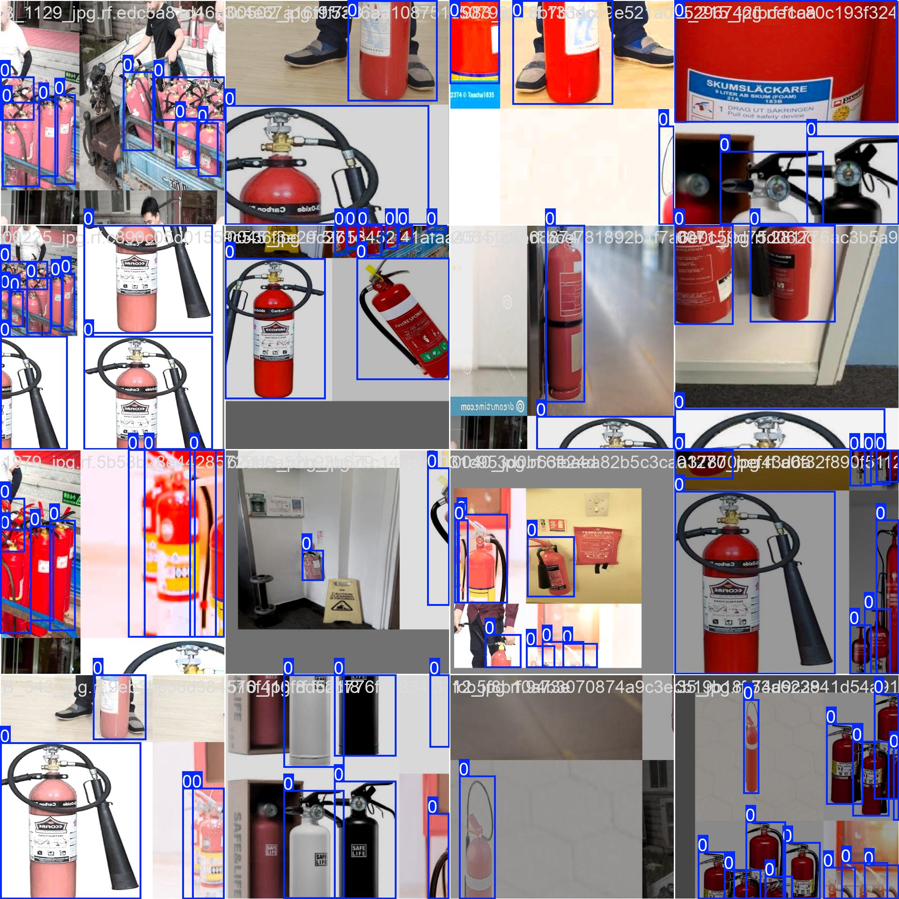

# Detecção de extintores de incêndio

## Introdução

### Identificação 
* Adriando de Arruda Pereira Filho - 20220025597.
* [Apresentação](https://www.canva.com/design/DAGc2kmDxOA/7aXfJZhABipGFpwxNXxM1A/view?utm_content=DAGc2kmDxOA&utm_campaign=designshare&utm_medium=link2&utm_source=uniquelinks&utlId=h30b63acd40) 

### Informações Gerais 
#### Problema
Identificar extintores de incêndio é uma atividade essencial para a segurança em diferentes ambientes e locais públicos. O fácil acesso a esses dispositivos de segurança é indispensável para garantir a segurança pública em casos de incêndios, e deve estar de acordo com as normas de segurança.

Este projeto tem como objetivo criar um sistema que identifique e reconheça extintores de incêndio utilizando o modelo de detecção de objetos conhecido como [YOLO](https://docs.ultralytics.com/pt) (You Only Look Once). A tarefa envolve o treinamento de um modelo capaz de identificar e localizar extintores em vídeos ou imagens, com o intuito de facilitar a verificação da presença desses dispositivos em locais críticos.
#### Base de Dados.
Para o treinamento do modelo de detecção de extintores de incêndio, foi utilizado um dataset já existente da plataforma [Roboflow](https://roboflow.com/) que fornece imagens anotadas para a detecção de extintores em diferentes cenários.

Dataset: [Fire Extinguisher Detect Computer Vision Project](https://universe.roboflow.com/fire-extinguisher-detect-ddy5c/fire-extinguisher-detect)
* Quantidade de imagens: 9636
* Anotações: As imagens estão anotadas com caixas delimitadoras e a classe “fire_extinguisher”.
<div style="display: flex; justify-content: space-around;">
  
  
</div>

## Metodologia 
### Técnicas de Machine Learning (ML)
Utilizamos a técnica de aprendizado profundo com a arquitetura YOLO (You Only Look Once) para realizar a detecção de extintores de incêndio em imagens ou videos. O YOLO é um modelo de detecção em tempo real que realiza a previsão de múltiplos objetos em uma imagem com uma única passagem pela rede neural. Ele é altamente eficiente, pois divide a imagem em uma grade e, em cada célula, faz previsões sobre a presença de objetos e suas respectivas localizações (caixas delimitadoras).
### Etapas do treinamento e teste
O dataset utilizado foi obtido da plataforma Roboflow, com as imagens já anotadas com caixas delimitadoras e rótulos corretos. Os dados foram divididos em três conjuntos: treinamento (70% das imagens), validação (20%) e teste (10%). As imagens foram redimensionadas para 640x640, conforme especificado no dataset. Após o treinamento, o modelo foi avaliado para monitorar o desempenho e ajustar hiperparâmetros, como a taxa de aprendizado e o número de épocas, sendo finalmente testado em um conjunto de dados separado, que não foi utilizado durante o treinamento.
## Códigos 
O código importa a biblioteca "ultralytics" que contém o modelo YOLO para detecção de objetos. Em seguida, o modelo YOLOv11 é instanciado utilizando o arquivo `yolo11x.pt`, que contém os pesos do modelo treinado. O modelo é configurado para ser treinado com o método `train()`, onde são especificados os parâmetros: o caminho do arquivo de dados "data.yaml" que define o conjunto de dados de treinamento, o número de épocas de treinamento (40), o tamanho das imagens de entrada (640x640 pixels) e o dispositivo (GPU com id 0) a ser utilizado para o treinamento. Isso resulta em um treinamento do modelo para detectar objetos relacionados ao conjunto de dados fornecido.
```python
# Importando a biblioteca necessária.
from ultralytics import YOLO
# instanciando o yolo11.
model = YOLO("yolo11x.pt")
# Coloca o modelo em modo de treinamento
model.train(data="/home/adriano/am/data_4/Fire-Extinguisher-Detect-1/data.yaml", epochs=40, imgsz=640, device=0)
```
Este comando é usado para testar a rede neural treinada em um vídeo. A opção `task=detect` indica que a tarefa é detecção, enquanto `mode=predict` define o modo de previsão. O modelo é carregado a partir do arquivo `best.pt`, que contém os pesos do melhor modelo treinado. A confiabilidade mínima para detectar objetos é definida por `conf=0.60` (60%). O arquivo de entrada é o vídeo `teste.mp4`, e `save=True` indica que o resultado da detecção será salvo em um novo vídeo com as anotações das detecções.
```sh
yolo task=detect mode=predict model=runs/detect/train/weights/best.pt conf=0.60 source='teste.mp4' save=True
``` 
* Informar o link para acessar o código.
## Experimentos
### Testes
Para os testes, foi utilizado um vídeo que apresenta diversos tipos de extintores em diferentes locais, com variações de iluminação e distâncias. Esses cenários ajudaram a avaliar a capacidade do modelo de detectar extintores em condições variadas, como diferentes ângulos de visão, iluminação inconsistente e distâncias variadas, que são comuns em situações reais de uso.
### Parâmentros Avaliados
Foram avaliados três parâmetros principais: **confiança mínima** (`conf`), **distância e ângulo dos extintores**, e **iluminação**. O ajuste de confiança para 0.60 ajudou a reduzir falsos positivos, mas alguns extintores em distâncias maiores ou parcialmente obstruídos não foram detectados. Em relação à **distância e ângulo**, o modelo teve bom desempenho em distâncias curtas e médias, mas apresentou dificuldades em detectar extintores distantes ou em ângulos extremos. Quanto à **iluminação**, o modelo teve alta precisão em boas condições de luz, mas sua acuracidade diminuiu em cenários de baixa iluminação ou com iluminação contrastante, sugerindo que melhorias são necessárias para lidar com variações de luz.
### Resultados
Os resultados mostraram que a rede neural teve dificuldades em detectar extintores a longas distâncias, provavelmente devido à resolução limitada e ao tamanho reduzido dos objetos. Além disso, em alguns casos, o modelo confundiu pessoas com extintores, o que pode ser causado por semelhanças visuais entre ambos, especialmente em determinados ângulos e condições de iluminação. Isso indica que ajustes no treinamento e melhorias na resolução das imagens podem ajudar a resolver esses problemas e melhorar a precisão da detecção.
<p align="center">
  
</p>

## Conclusão 
O trabalho atendeu parcialmente aos objetivos. Embora o modelo tenha sido capaz de detectar extintores com precisão em distâncias curtas e médias, ele não conseguiu detectar extintores a longas distâncias, como esperado. Além disso, a confiabilidade do modelo ainda não está ideal, com alguns erros de detecção, como a confusão entre extintores e pessoas. Esses problemas podem ser resolvidos com um conjunto de dados maior, que cubra uma variedade maior de cenários, como diferentes distâncias, ângulos e condições de iluminação, e também com um número maior de épocas de treinamento, permitindo que o modelo aprenda melhor as características dos extintores em diversas situações.
